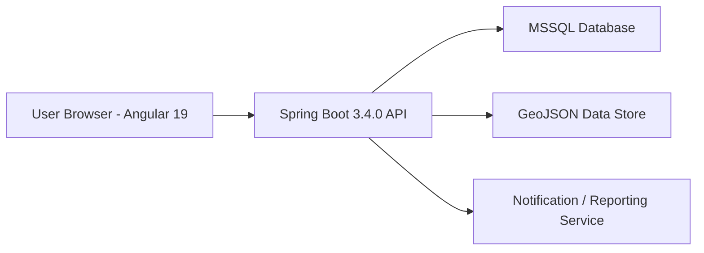
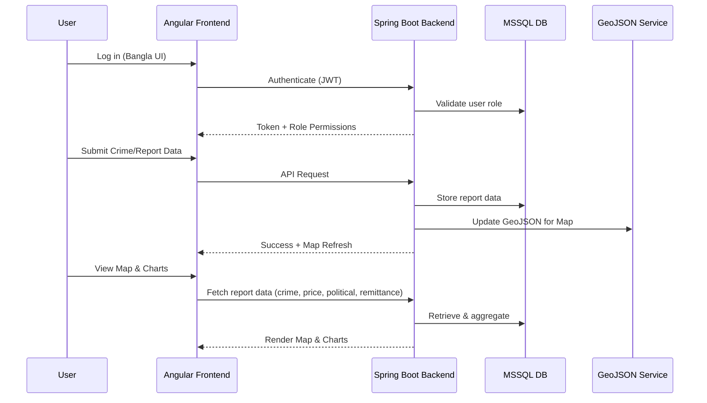

# Crime & Socio-Economic Report System

A comprehensive reporting and visualization system built with **Angular 19** (frontend) and **Spring Boot 3.4.0** (backend, Java 21) to track and analyze crime data, political incidents, commodity prices, and remittance trends.  
The application supports **Bangla (Unicode)** natively, uses **MapLibre-GL** for interactive mapping, and **GeoJSON** for geospatial data representation.

---

## Features

### 1. Multi-Category Reporting
- **Crime Reports**: Capture and analyze local crime incidents.  
- **Political Reports**: Track rallies, unrest, or significant events.  
- **Commodity Prices**: Monitor price fluctuations of essential goods.  
- **Remittance Trends**: Visualize remittance inflows by region.

### 2. Interactive Map Visualization
- **MapLibre-GL** based maps with local tiles.  
- Display data layers using **GeoJSON** (crime hotspots, political zones, etc.).  
- Cluster markers, heatmaps, and boundary overlays.

### 3. Charts & Analytics
- Rich charts for statistical insights (crime trends, price trends, remittance graphs).  
- Time-series analysis and comparison across data categories.

### 4. Role-Based User Management
- **Permission-based system** for different user roles (Admin, Analyst, Viewer).  
- Access control to sensitive reports and actions.

### 5. Technology Stack
- **Frontend**: Angular 19  
- **Backend**: Spring Boot 3.4.0 (Java 21)  
- **Database**: Microsoft SQL Server  
- **Mapping**: MapLibre-GL + GeoJSON  
- **Authentication**: Role-based JWT  
- **Charts**: Chart.js / D3.js integration

---

## Architecture Diagram



---

## Workflow Diagram



---

## Installation & Setup

### Prerequisites
- **Node.js** (v20+) & Angular CLI  
- **Java 21** & Maven  
- **Microsoft SQL Server**  
- **MapLibre-GL** tiles & GeoJSON data

---

### Backend (Spring Boot)
```bash
# Clone repository
git clone https://github.com/ma-muktadeer/crime-report-map.git
cd server/dgfi-location-tracker-server

# Configure application.properties
# - MSSQL connection
# - JWT keys
# - Map/GeoJSON paths
# - Place all the Frontend build files in the server/dgfi-location-tracker-server/src/main/resources/static directory. **ie, If the static directory is not found the create this folder.**

# Build and run JAR
mvn clean install
java -jar target/crime-report-app.jar
```

---

### Frontend (Angular)
Download the tiles file from [here](https://drive.google.com/file/d/1qqq_-lahYcgd8WJ9kcIeVQwzBa48aCHk/view?usp=sharing) and unzip it to the `client/dgfi-loc-tkr/src/assets` directory.  
**This zip contains two folders: 1. tiles and 2. geojson**

**The final Angular Application Structure Is Like
```
Angular/
├── src/
│   ├── app/
│   ├── assets/
|   |  ├── tiles
|   |     └── pbf
|   |        └── 0
|   |        |  └── 0
|   |        |    └── 0.pbf
|   |        └── 1
|   |          └── 0
|   |            ├── 0.pbf
|   |            └── ...
│   └── index.html
├── .mbtiles (not included)
└── ...
```

```bash
# Navigate to frontend
cd client/dgfi-loc-tkr

# Install dependencies
npm install

# Run the application
ng serve

```

Open browser at: `http://localhost:4200` (Bangla UI)

---

### Local Tile Server Setup

For offline/local map rendering, the project includes a **tile-server.js** script.

```bash
# Install dependencies (if not done yet)
npm install

# Run local tile server
node tile-server.js
```

The tile server will start on: `http://localhost:8000`  
Update **MapLibre-GL** config in Angular to point to this tile URL.

---

## Deployment Notes

- **Backend Deployment**: Deploy the Spring Boot JAR (`crime-report-app.jar`) to your server or container runtime.  
- **Frontend Deployment**: Build Angular using `ng build --prod` and serve via Nginx/Apache or integrate with Spring Boot static resources.  
- **Tile Server**: Can be run alongside the backend or on a separate port for local/offline use.  
- Ensure proper environment configuration for database, JWT keys, and map tile paths.

---

## Configuration

- **GeoJSON Layers**: Configurable for crime, political, price, and remittance data.  
- **Permissions**: Managed via backend role system.  
- **MapLibre Source**: Local tiles configured for offline/secure environments.

---

## Future Enhancements
- AI-driven predictive analysis for crime hotspots.  
- Real-time commodity price feeds integration.  
- Multi-language (Bangla + English) toggle.  
- Offline-first PWA support.

---

## License

This project is proprietary and intended for internal governmental/organizational use only.
